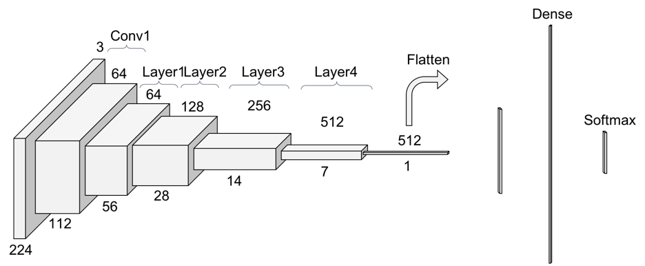

# Classification de type de guitare
Classification binaire de guitare à l'aide du modèle pré-entrainé RESNET 34&amp;50.

Dans ce mini projet, nous utilisons les outils suivants : **Google Drive, Colab, Pytorch, RESNET34 et fast.ai** pour classifier des images de guitares à l'aide 
d'un modèle **CNN**.

Brièvement, le principe de la classification d'images par deep learning consiste à extraire et apprendre les caracteristiques des images d'un ensemble
d'apprenstissage appelé **Training set**, puis de valider le modele sur un  ensemble de validation ou **development set** et tester la performance du modèle sur un troisième jeu de données
appélé **Test set**.

Les modèle pré-entrainés que nous utilisons sont le **RESNET34** (34 couches cachées) et **RESNET50**, l'un des plus célèbres modèles dédiés à la classification d'images developpé par des chercheurs asiatiques en 2016 ([lien de l'article](https://arxiv.org/pdf/1512.03385.pdf)).
On utlise les deux modèles et on choisis à la fin le meilleur pour faire notre prédiction.

L'architecture du modèle **RESNET** se présente comme suit :

Tous ce que nous avons à faire est de spécifier le modèle (dejà entrainé sur des millions d'images) à notre problème de classification. En d'autres termes dans le jargon "**data scientist**" : faire du [**transfert learning**](https://machinelearningmastery.com/transfer-learning-for-deep-learning/).

RES...NET... ! 

